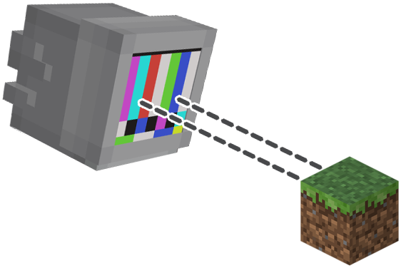
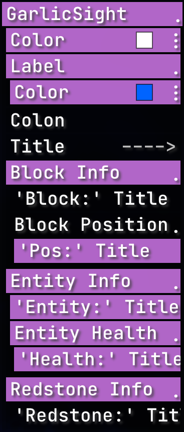
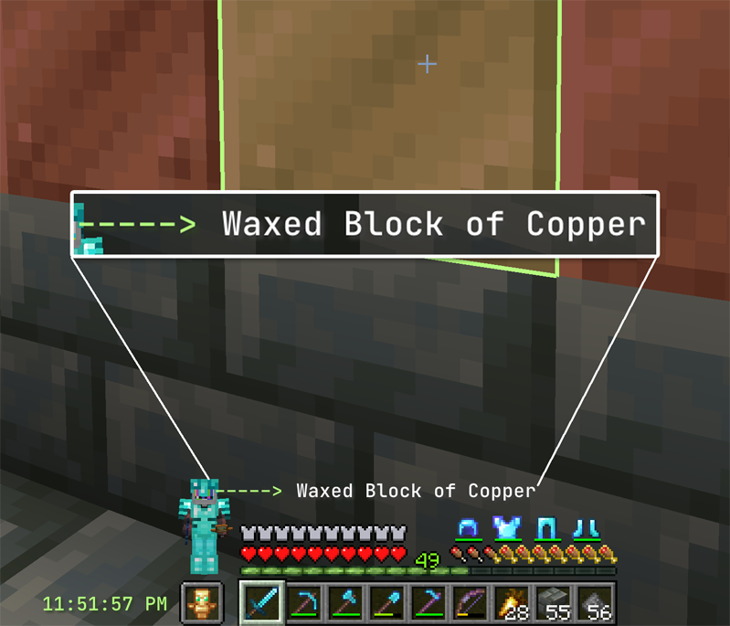
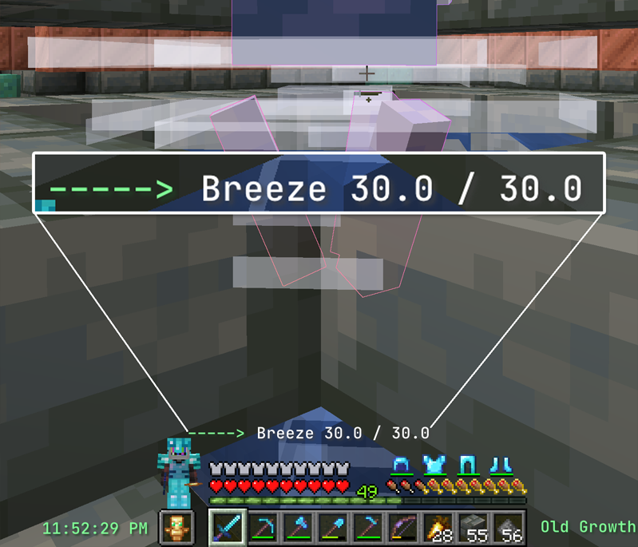

    

<h1 align="center">GarlicSight</h1>

A RusherHacks Crosshair Info Plugin - GarlicSight

  
  

## Features:

- **Display Block Information:** Details about the block you're targeting.
- **Display Entity Information:** Details about mobs, players, and other entities.
- **Customize Display Settings:** Toggle titles like 'Block:', 'Entity:', 'Position:', or 'Health'.

## HUD Element Settings:

    

## Screenshots:

  
  

## Contributing:

Contributions are welcome! Please see the [CONTRIBUTING.md](CONTRIBUTING.md) file for guidelines on how to contribute to this project.
